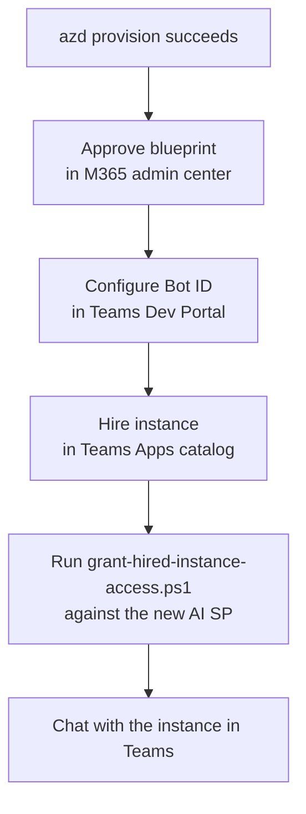

# Troubleshooting — Foundry A365 Digital Worker

Real-world fixes we hit while bringing a freshly-cloned copy of this sample
all the way from `azd init` to a working hired instance in Microsoft Teams.

If you cloned this sample and `azd provision` succeeded but the digital
worker isn't responding correctly in Teams, work through the checks below
**in order**. They're listed in the order they're likely to bite you.

---

## TL;DR — what to do after `azd provision` succeeds



The five steps above are **all required**. The sample's post-provision
scripts only cover the blueprint identity; everything from step B onward is
manual unless you script it yourself.

---

## 1. Approve the blueprint in the M365 admin center

**Symptom**: `MAIB.agentIdentityBlueprint.provisioningState` is stuck on
`"Creating"`. Agentic-user OBO token exchange fails and your hosted agent
can't acquire any MCP bearer token at runtime.

**Check**:
```powershell
$token = az account get-access-token --resource https://ai.azure.com --query accessToken -o tsv
$endpoint = (azd env get-value AZURE_AI_PROJECT_ENDPOINT)
$maib     = (azd env get-value MAIB_NAME)
(Invoke-RestMethod -Uri "$endpoint/managedagentidentityblueprints/$maib`?api-version=2025-11-15-preview" `
  -Headers @{ Authorization = "Bearer $token" }).agentIdentityBlueprint.provisioningState
```

**Fix**: open https://admin.cloud.microsoft/?#/agents/all/requested, find
your blueprint, click **Approve request and activate**, wait ~1-5 minutes,
re-run the check until it returns `"Active"`. *Only a tenant admin can do
this.*

---

## 2. Configure the Bot ID in the Teams Developer Portal

**Symptom**: blueprint is `Active`, but the agent never appears as available
in the Teams Apps catalog, or hired instances can't open a chat.

**Fix**: open
`https://dev.teams.microsoft.com/tools/agent-blueprint/<BLUEPRINT_ID>`,
go to **Configuration**, paste the same blueprint id into the **Bot ID**
field, save.

---

## 3. Hired instances need their own OAuth grants + RBAC (NOT in the sample)

This is the #1 reason people hit `HTTP 400` / `Status: 400` /
`Endpoint doesn't support entra auth` on the very first message.

### Background — two service principals per hire
When a user hires your digital worker in Teams, Microsoft 365 creates two
brand-new Entra objects:

| Object | What it is | Example |
|---|---|---|
| **AI** | `ServiceIdentity` service principal — your hired instance's identity. This is the principal that runs the OBO token exchange at every turn. | `894f4f2b-…` "Signal Digital Worker" |
| **AU** | `agentUser`-type Entra user — the user identity the AI acts on behalf of. | `734a97bc-…` `signaldigitalworker@yourtenant.onmicrosoft.com` |

The shipped `create-blueprintsp-oauth2-grants.ps1` only grants on the
**blueprint** SP. The AI SP — the one that actually runs at message time —
starts life with **zero** OAuth grants and **zero** Azure RBAC.

### Symptoms

| Symptom | Root cause |
|---|---|
| Teams shows `I encountered an error processing your request. Status: 400` and the agent's session logs include `external_connector_error` / `Error retrieving tool list from MCP server: 'mcp_<X>'. Http status code: 400` | AI SP has no OAuth grants for `ea9ffc3e-…` (Agent Tools / MCP). The MCP gateway gets a bad / missing bearer and returns 400. |
| Direct POST to `…/agents/<name>/endpoint/protocols/activityProtocol` returns `403 Endpoint doesn't support entra auth and no valid bot service token was provided` | AI SP is missing `AgentData.ReadWrite` on the Messaging Bot API SP (`5a807f24-…`). |
| Teams shows nothing or errors when the agent tries to call the Responses API / Azure OpenAI | AI SP has no Cognitive Services / Foundry RBAC on the Foundry account. |

### Fix

Run the helper:
```powershell
./scripts/grant-hired-instance-access.ps1 -AiClientId <AI appId>
```

Find the AI appId in Entra (Enterprise Applications) by searching for the
display name of the hired worker (e.g. "Signal Digital Worker"), or with
Microsoft Graph:
```powershell
$prefix = "<your account name>-<your project name>"  # e.g. signalteammateacct-signalteammateproj
$graph  = az account get-access-token --resource https://graph.microsoft.com --query accessToken -o tsv
(Invoke-RestMethod -Uri "https://graph.microsoft.com/v1.0/servicePrincipals?`$filter=startswith(displayName,'$prefix')&`$select=id,appId,displayName,servicePrincipalType" `
  -Headers @{Authorization="Bearer $graph"}).value | Where-Object servicePrincipalType -eq ServiceIdentity
```

The helper grants:

1. **OAuth2 delegated** (consentType `AllPrincipals`) on the AI SP:
    - All `McpServers.*` scopes on Agent Tools (`ea9ffc3e-…`)
    - `AgentData.ReadWrite` on Messaging Bot API (`5a807f24-…`)
2. **Azure RBAC** on the AI SP:
    - **Foundry User** (`53ca6127-…`) on the Foundry account *and* project
    - **Cognitive Services User** (`a97b65f3-…`) on the Foundry account
    - **Cognitive Services OpenAI User** (`5e0bd9bd-…`) on the Foundry account

Wait 1-2 minutes after running it for RBAC to propagate, then retry in
Teams.

---

## 4. Use canonical MCP scopes from `Azure/MCP/partners/servers/a365-*.json`

The MCP scope strings are easy to get subtly wrong. The canonical source of
truth is the file in `Azure/MCP/partners/servers/`:

| Server label | Scope |
|---|---|
| `mcp_WordServer` | `McpServers.Word.All` |
| `mcp_MailTools` | `McpServers.Mail.All` |
| `mcp_ExcelServer` | `McpServers.Excel.All` |
| `mcp_CalendarTools` | `McpServers.Calendar.All` |
| `mcp_TeamsServer` | `McpServers.Teams.All` |
| `mcp_MeServer` | `McpServers.Me.All` |
| `mcp_M365Copilot` | `McpServers.CopilotMCP.All` |
| `mcp_OneDriveRemoteServer` | **`McpServers.OneDrive.All`** (not `OneDriveSharepoint.All`) |
| `mcp_SharePointRemoteServer` | **`McpServers.SharePoint.All`** (not `OneDriveSharepoint.All`) |
| `mcp_ODSPRemoteServer` *(legacy combined)* | `McpServers.OneDriveSharepoint.All` |
| `mcp_AdminTools` | `McpServers.M365Admin.All` |

If you add a new MCP server to `ToolingManifest.json`, also add its scope
string to `scripts/create-blueprintsp-oauth2-grants.ps1` so the blueprint
SP grant covers it on next provision.

The helper `scripts/grant-hired-instance-access.ps1` already includes the
full set, including both `OneDrive.All` and `SharePoint.All` (and keeps the
legacy `OneDriveSharepoint.All` for back-compat).

---

## 5. Rolling out new code/manifest changes — DO NOT re-publish

When you change `agent.py`, `ToolingManifest.json`, `host_agent_server.py`,
etc., the rollout path is:

1. `./scripts/build-docker-image-acr.ps1` — rebuilds image, pushes to ACR.
2. `./scripts/agent-creation-script.ps1` — creates a **new agent version**
   (v2, v3, …) pointing at the new image.

That's it. The agent's `agent_endpoint.version_selector` defaults to
`@latest` and routes 100% of traffic to the newest active version, so all
existing hired instances pick up the new code automatically — **no
re-hire, no re-publish, no admin re-approval**.

**Do NOT re-run `publish-digital-worker.ps1`** for code/manifest changes.
That creates a *new* digital worker publish record, which leaves your
already-hired instances stranded on the old version.

The shipped `scripts/post-provision.ps1` has the publish step commented out
specifically so accidental re-provisions don't re-publish. Only un-comment
it if you intentionally want to register a brand-new digital worker.

### Pinning to a specific version (for debugging a bad rollout)

If a new version doesn't ready (HTTP 502 readiness failures), you can pin
back to an older known-good version to isolate:
```powershell
$token = az account get-access-token --resource https://ai.azure.com --query accessToken -o tsv
$endpoint = (azd env get-value AZURE_AI_PROJECT_ENDPOINT)
$agent    = (azd env get-value AGENT_NAME)

$patch = @{
  agent_endpoint = @{
    protocols = @("activity")
    authorization_schemes = @(@{ type = "BotServiceRbac" })
    version_selector = @{
      version_selection_rules = @(
        @{ type = "FixedRatio"; agent_version = "1"; traffic_percentage = 100 }
      )
    }
  }
} | ConvertTo-Json -Depth 8

Invoke-RestMethod -Method PATCH `
  -Uri "$endpoint/agents/$agent`?api-version=2025-11-15-preview" `
  -Headers @{ Authorization = "Bearer $token"; "Content-Type" = "application/json"; "Foundry-Features" = "HostedAgents=V1Preview,AgentEndpoints=V1Preview" } `
  -Body $patch
```
Replace `"1"` with the version you want to pin to, or `"@latest"` to
unpin.

---

## 6. ACR build name length / character constraints

**Symptom**: `azd provision` fails creating the Azure Container Registry
with an error about invalid name.

**Cause**: ACR names must be alphanumeric only (no hyphens, no underscores).
The Bicep computes `${environmentName}acr`, so if your `environmentName`
contains a hyphen, ACR creation fails.

**Fix**: when you `azd env new` or set `infra.parameters.environmentName`,
use lowercase alphanumeric only (e.g. `signalteammate`, not
`signal-teammate`). The Bicep still lets `agentName` be hyphenated
separately.

---

## 7. azd needs the bicep params set even though they look "obvious"

**Symptom**: `azd provision --no-prompt` fails with
`missing required inputs: environmentName, location`.

**Cause**: `azd` doesn't automatically pass `AZURE_ENV_NAME` /
`AZURE_LOCATION` into the Bicep `environmentName` / `location` params.

**Fix**:
```powershell
azd env config set infra.parameters.environmentName <your-env-name>
azd env config set infra.parameters.location swedencentral
azd provision
```

---

## 8. Reading hosted-agent logs

If you have a session id (returned in error responses, or surfaced as
`FOUNDRY_AGENT_SESSION_ID`), stream the per-session logs with:

```powershell
$token   = az account get-access-token --resource https://ai.azure.com --query accessToken -o tsv
$account = (azd env get-value ACCOUNT_NAME)
$project = (azd env get-value PROJECT_NAME)
$agent   = (azd env get-value AGENT_NAME)
$session = "<your session id>"

curl.exe -N `
  -H "Authorization: Bearer $token" `
  -H "Accept: text/event-stream" `
  -H "Cache-Control: no-cache" `
  -H "Foundry-Features: HostedAgents=V1Preview" `
  "https://$account.services.ai.azure.com/api/projects/$project/agents/$agent/sessions/$session`:logstream?api-version=2025-11-15-preview"
```

Sessions are short-lived and get cleaned up after failure — grab the id
within ~1 minute of the failed turn.

---

## 9. Multi-agent chats and the typing indicator

Two unrelated quality-of-life things people hit:

- **`Working on your request...` chat bubble**: comes from a literal
  `await context.send_activity("Working on your request...")` near line 340
  in `host_agent_server.py`. Comment it out (leave the
  `Activity(type="typing")` line below it) if you want Teams' built-in
  silent typing animation only.
- **Multiple AI agents in one chat racing**: when you have several AI agents
  added to the same Teams chat (e.g. Signals + Carson), the SDK can drop one
  agent's final reply if both think they were addressed. Test in a 1:1 chat
  or use explicit `@`-mentions to disambiguate.

---

## Quick state checks

```powershell
# What version is traffic routed to right now?
$token = az account get-access-token --resource https://ai.azure.com --query accessToken -o tsv
$endpoint = (azd env get-value AZURE_AI_PROJECT_ENDPOINT)
$agent    = (azd env get-value AGENT_NAME)
(Invoke-RestMethod -Uri "$endpoint/agents/$agent`?api-version=2025-11-15-preview" `
  -Headers @{ Authorization = "Bearer $token"; "Foundry-Features" = "HostedAgents=V1Preview" }).agent_endpoint.version_selector

# List all versions and their provisioning status
(Invoke-RestMethod -Uri "$endpoint/agents/$agent/versions?api-version=2025-11-15-preview" `
  -Headers @{ Authorization = "Bearer $token"; "Foundry-Features" = "HostedAgents=V1Preview" }).data |
  Select-Object version, status, @{n="image";e={$_.definition.image}} | Format-Table

# All RBAC for a given service principal
az role assignment list --assignee <AI-appId> --all `
  --query "[].{role:roleDefinitionName, scope:scope}" -o table

# All delegated OAuth2 grants from a given service principal
$graph = az account get-access-token --resource https://graph.microsoft.com --query accessToken -o tsv
$spId  = (az ad sp show --id <AI-appId> --query id -o tsv)
(Invoke-RestMethod -Uri "https://graph.microsoft.com/v1.0/oauth2PermissionGrants?`$filter=clientId eq '$spId'" `
  -Headers @{Authorization="Bearer $graph"}).value |
  ForEach-Object { [pscustomobject]@{ resourceId = $_.resourceId; scope = $_.scope } }
```
