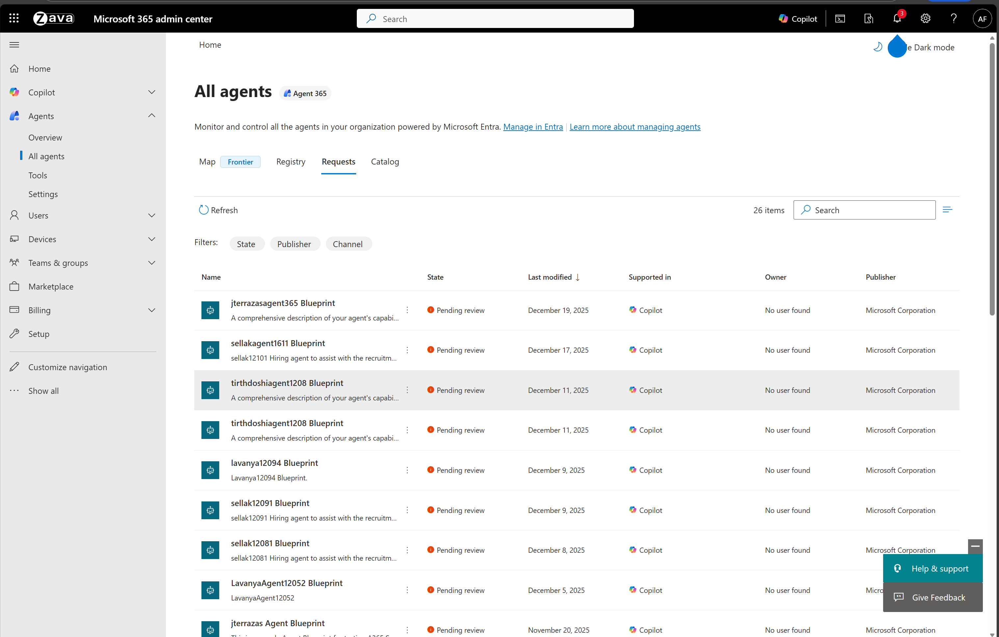
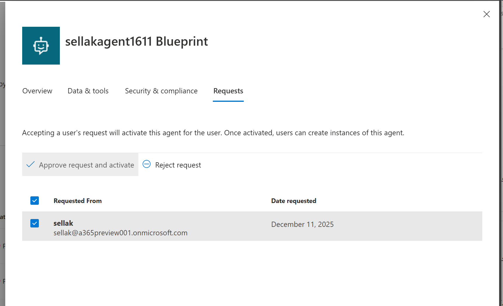

# 🤖 Release Captain — Foundry A365 Autopilot Agent

> Release Captain is an AI teammate that offloads the release-coordination paperwork
> for the NotARealCo Checkout team. It runs the chase loop on the team's 8-gate
> release-readiness process, drafts the surrounding communications and meeting
> artifacts, and keeps readiness state visible — so feature PMs and engineers can
> focus on shipping the features themselves.
>
> This sample is a variation of the [foundry-ai-teammate](../foundry-ai-teammate)
> sample. The infrastructure topology and runtime are identical; only the agent
> prompt (in [`agent.py`](./src/release_captain_a365_agent/agent.py)) defines the
> Release Captain persona. The full behavioral spec lives in
> [`sherpa/agents/release-captain/SPEC.md`](https://github.com/microsoft/sherpa/blob/main/agents/release-captain/SPEC.md).

---

## 📋 Prerequisites

**Note:** You must be enrolled in the [Frontier preview program](https://adoption.microsoft.com/en-us/copilot/frontier-program/) to publish a Foundry agent to Microsoft Agent 365.

Ensure you have the following installed:

| Requirement | Description |
|-------------|-------------|
| [Azure Developer CLI](https://learn.microsoft.com/azure/developer/azure-developer-cli/install-azd) | Infrastructure deployment tool |
| [Python 3.11+](https://www.python.org/downloads/) | Agent runtime (built and packaged inside the Docker image) |
| [Docker](https://www.docker.com/products/docker-desktop/) | Required for the local ACR build step (or use `az acr build` directly) |

### 🔐 Required Permissions

- **Owner** role on the Azure subscription
- **Azure AI User** or **Cognitive Services User** role at subscription or resource group level
- **Tenant Admin** role for organization-wide configuration

---

## 🚀 Quick Start

### Step 1: Authenticate

Login to your Azure tenant and authenticate with Azure Developer CLI. Depending on your tenant's security settings, `az login` alone may be sufficient, or you may need to additionally sign in for the specific scopes used by the deployment scripts.

```powershell
# Login to Azure CLI
az login

# Login to Azure Developer CLI
azd auth login
```

### Step 2: Deploy Everything

> **📍 Region availability:** This sample uses [Foundry hosted agents](https://learn.microsoft.com/en-us/azure/foundry/agents/quickstarts/quickstart-hosted-agent?pivots=azd). Your Foundry account and other resources must be in a region where hosted agents are available. At the time of writing, supported regions are:
>
> Australia East, Brazil South, Canada Central, Canada East, East US, East US 2, France Central, Germany West Central, Italy North, Japan East, Korea Central, North Central US, Norway East, Poland Central, South Africa North, South Central US, South India, Southeast Asia, Spain Central, Sweden Central, Switzerland North, UAE North, UK South, West Central US, West US, West US 3.

#### Optional: Customize Your Agent

Before deploying, you can customize:
- **Agent instructions:** [agent.py](./src/release_captain_a365_agent/agent.py) (the `AGENT_PROMPT` constant on `ReleaseCaptainAgent`)
- **MCP tools:** [ToolingManifest.json](./src/release_captain_a365_agent/ToolingManifest.json) - [Learn more](https://learn.microsoft.com/en-us/microsoft-agent-365/tooling-servers-overview)

#### Deploy

Ensure Docker is running, then execute:

```powershell
azd provision
```

After deployment completes, retrieve your resource values:

```powershell
azd env get-values
```

> **📌 What to expect after deployment:**  
> After `azd provision` completes successfully, you will see the **AgentIdentityBlueprint** in the Agents registry. You will **not** see any agents in the requests tab yet. This is expected behavior - you must first approve the agent blueprint, configure it in Teams Developer Portal, and then create agent instances based on that blueprint.

### Step 3: Approve the Agent Blueprint

**Important:** The first step is to approve the **agent blueprint** itself. Agent instances will be created later in Step 5.

1. Navigate to the [Microsoft 365 admin center](https://admin.cloud.microsoft/?#/agents/all/requested)
2. Under **Requests**, locate your **agent blueprint**:
   

3. Click the **Approve request and activate** button to approve the blueprint:
   

### Step 4: Configure Teams Integration

After approving the agent blueprint, configure it in the Teams Developer Portal:

1. Open the [Teams Developer Portal](https://dev.teams.microsoft.com/tools/agent-blueprint) and locate your approved agent blueprint
    
   **Note:** Only 100 Agent Blueprints are displayed. If yours isn't visible, click any blueprint to open its details page, then in the browser's address bar replace the blueprint ID portion of the URL with your own Blueprint ID from the previous step (for example: `https://dev.teams.microsoft.com/tools/agent-blueprint/<your-blueprint-id>`).
   

2. Get your Blueprint ID:
   ```powershell
   azd env get-values
   ```

3. Navigate to **Configuration** and add your **Bot ID** (same as Blueprint ID):
   

### Step 5: Create Agent Instances

After configuring the agent blueprint in Teams Developer Portal, you can now create agent instances based on your blueprint:

1. In Microsoft Teams, navigate to **Apps** → **Agents for your team**
2. Find your agent blueprint and create an instance:
   

### Step 6: Grant the hired instance access (REQUIRED)

> **⚠️ The post-provision scripts only configure the *blueprint* identity. Every hired instance in Teams gets its own brand-new service principal (the "AI") that starts with zero OAuth grants and zero Azure RBAC.** Without this step, the very first message in Teams will fail with `Status: 400` or `Endpoint doesn't support entra auth`.

1. In Entra **Enterprise Applications**, find the service principal whose display name matches your hired instance (e.g. `Release Captain`). Copy its **Application ID**.
2. From the sample root, run:
   ```powershell
   ./scripts/grant-hired-instance-access.ps1 -AiClientId <hired-instance-appId>
   ```
   This grants:
   - All `McpServers.*` OAuth2 scopes on the Agent Tools resource and `AgentData.ReadWrite` on the Messaging Bot API resource (both AllPrincipals delegated grants).
   - `Foundry User` on the Foundry account *and* project; `Cognitive Services User` and `Cognitive Services OpenAI User` on the Foundry account.
3. Wait 1–2 minutes for RBAC to propagate, then chat with the agent in Teams.

For details and other failure modes, see [TROUBLESHOOTING.md](./TROUBLESHOOTING.md).

---

## 🧹 Cleanup / tearing it all down

`azd down` only removes the Azure resources it provisioned. It does **not** revoke the OAuth2 grants and RBAC role assignments that `grant-hired-instance-access.ps1` created for each hired instance, and it does **not** retract the digital worker publish record. Tear things down in this order:

1. **Per hired instance — revoke its grants and role assignments.**
   For every hired-instance service principal you ran the grant script against, run the matching cleanup script:

   ```powershell
   ./scripts/cleanup-hired-instance-access.ps1 -AiClientId <hired-instance-appId>
   ```

   Add `-WhatIf` first to see exactly what would be deleted, or `-Force` to skip the confirmation prompt. The script is idempotent — missing grants and missing role assignments are reported and skipped.

2. **(Optional) Delete the hired-instance service principal.**
   The cleanup script intentionally leaves the SP in place so Entra audit logs stay coherent. If you want it gone:

   ```powershell
   az ad sp delete --id <hired-instance-appId>
   ```

3. **(Optional) Retract the digital worker publish record.**
   Cleanup of the Microsoft 365 publish created by `publish-digital-worker.ps1` is done in the [Microsoft 365 admin center](https://admin.cloud.microsoft/?#/agents/all) — find the agent under **Agents**, then **Remove** it. There is no `azd`-managed counterpart for this step.

4. **Tear down the Azure stack.**

   ```powershell
   azd down --purge
   ```

   `--purge` is recommended so the Foundry account, Key Vault, and other soft-deleted resources are fully removed rather than parked in the recovery state where their names stay reserved.

---

## 🔄 Rolling out changes (DO NOT re-publish)

When you change `agent.py`, `ToolingManifest.json`, or any container code, the rollout flow is:

```powershell
./scripts/build-docker-image-acr.ps1     # rebuild + push image
./scripts/agent-creation-script.ps1      # create a new agent version
```

The agent endpoint's `version_selector` is set to `@latest` and routes 100% of traffic to the newest active version. Existing hired instances pick up the new code automatically — **no re-hire, no re-publish, no admin re-approval required**.

**Do NOT re-run `publish-digital-worker.ps1`** for code/manifest updates. That creates a *new* digital worker publish record and leaves already-hired instances stranded on the old version. The shipped [`post-provision.ps1`](./scripts/post-provision.ps1) has the publish step commented out for this reason — only run it the first time you publish a digital worker.

---

## 🏗️ Architecture Overview

This deployment orchestrates five key components to create a fully functional A365 agent:

### 1️⃣ Creating a Foundry Project

Creates a Foundry project configured to support hosted agents with appropriate permissions on an Azure Container Registry for building and storing Docker images.

📚 [Learn more about prerequisites](https://github.com/microsoft/container_agents_docs?tab=readme-ov-file#11---prerequisites)

### 2️⃣ Setting up Azure Bot Service

Azure Bot Service acts as a relay between M365 ecosystem interactions and the Foundry application. The bot is configured with:

- Agent endpoint
- Agent's blueprint identity as the appId

### 3️⃣ Building a Hosted Agent Docker Image

Compiles the Python sample into a Docker container and registers it as a hosted agent with the Foundry project.

📚 [Learn more about building agents](https://github.com/microsoft/container_agents_docs?tab=readme-ov-file#14---build-agent-image)

### 4️⃣ Creating the Agent

Creates the hosted agent using the Docker image above.

📚 [Learn more about agent deployment](https://github.com/microsoft/container_agents_docs?tab=readme-ov-file#step-2-deploy-agent)

### 5️⃣ Publishing to Your Organization

Publishes the application to Microsoft 365 via Foundry API, creating a hireable digital worker with:

- Digital worker metadata
- Agent blueprint ID
- Digital worker designation

> **⚠️ Important:** The agent requires [admin approval](https://learn.microsoft.com/en-us/entra/identity/enterprise-apps/review-admin-consent-requests#review-and-take-action-on-admin-consent-requests-1) before becoming available for hiring.

---

## 📜 Hosted Agent Logs

If you receive an error, the response will include a `FOUNDRY_AGENT_SESSION_ID`. Use it to stream the hosted agent's session logs:

```bash
curl -N \
  -H "Authorization: Bearer $TOKEN" \
  -H "Accept: text/event-stream" \
  -H "Cache-Control: no-cache" \
  -H "Foundry-Features: HostedAgents=V1Preview" \
  "https://$ACCOUNT_NAME.services.ai.azure.com/api/projects/$PROJECT_NAME/agents/$AGENT_NAME/sessions/$SESSION_NAME:logstream?api-version=2025-11-15-preview"
```

---

## 📖 Additional Resources

- [**Troubleshooting guide**](./TROUBLESHOOTING.md) — symptoms + fixes for the common gotchas (blueprint approval, hired-instance grants, version pinning, log streaming, etc.)
- [Foundry Container Agents Documentation](https://github.com/microsoft/container_agents_docs)
- [Azure Developer CLI Documentation](https://learn.microsoft.com/azure/developer/azure-developer-cli/)
- [Agent Blueprint Configuration](https://dev.teams.microsoft.com/tools/agent-blueprint)

---

## 🤝 Support

For issues or questions, please refer to the official documentation or contact your Azure administrator.

